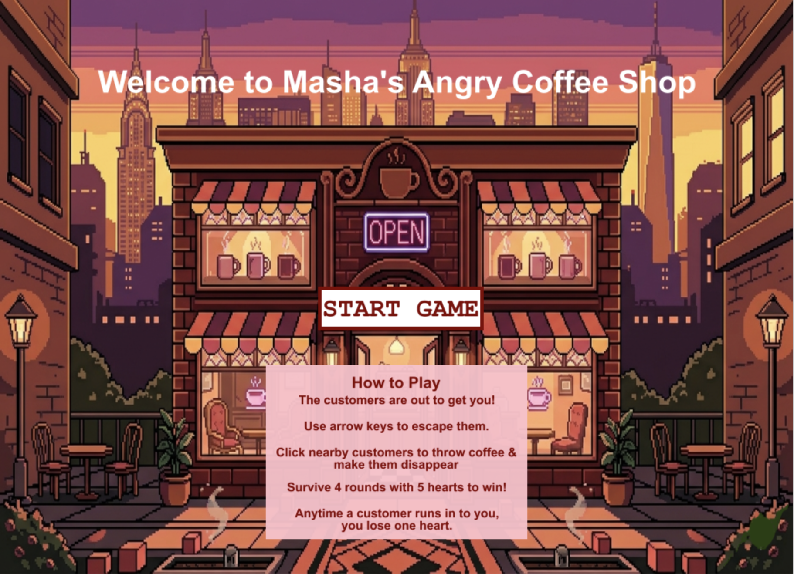
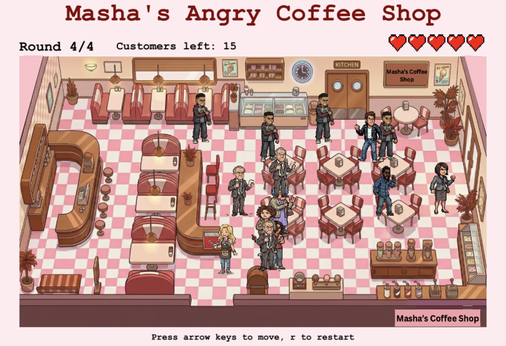

# Masha's Angry Coffee Shop

A survival game where you play as a coffee shop owner being chased by angry customers.
Click customers within throwing range to hit them with coffee. Survive 4 rounds to win!

## How to Play
- Arrow keys to move
- Click nearby customers to throw coffee at them
- Survive all 4 rounds with 5 hearts to win
- Press R to restart at any time

## Run the Game
Play it here: https://academy.cs.cmu.edu/sharing/oldLaceSheep360390

> Note: This project was built in CMU CS Academy and uses CMU Graphics.
> The code can be viewed here but must be run via the link above.

## Technical Implementation

**Language:** Python | **Course:** 15-112, Carnegie Mellon University

### 1. Backtracking Pathfinding
Each customer uses a recursive backtracking algorithm to navigate the walkable grid and 
chase the player. Candidate moves are sorted by Manhattan distance so customers always 
try to move toward the player first, only backtracking when blocked. To avoid rerunning 
the search every frame (which caused timeouts), customers cache their current path and 
only recalculate when the path is completed or invalidated.

### 2. Custom Walkable Grid
The cafe background is overlaid on a 15x16 grid with a hardcoded walkable cell list. 
Both the player and customers are constrained to walkable cells only, so no one can 
walk through tables, counters, or walls.

### 3. Multi-Screen Architecture
The start screen and game screen are managed through CMU's `runAppWithScreens`. A 
reusable `Button` class encapsulates position, label, and click detection, keeping 
screen logic clean and modular.

### 4. Increasing Difficulty
Each of the 4 rounds increases customer count and speed, and allows enemies to spawn 
closer to the player. Round 4 is the final boss round.

### 5. Coffee Projectile System
Clicking a customer within throw range spawns a `Coffee` object that tracks the 
target's position in real time. The customer is only removed when the coffee 
actually reaches them.